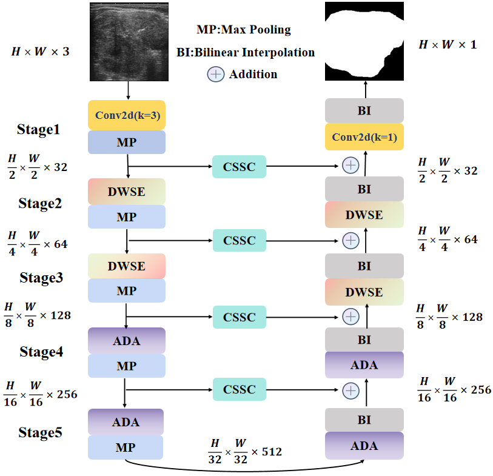

# DAC-Net

This repository is the official implementation of DAC-Net : An Light-weight U-shaped Network Based Efficient Convolution And Dual-Attention for Thyroid Nodule Segmentation using PyTorch.




## Main Environments

- python 3.9
- pytorch 2.1.0
- torchvision 0.16.0


## Requirements

Install from the `requirements.txt` using:

```
pip install -r requirements.txt
```


## Prepare the dataset.

- The DDTI datasets can be found here ([Link](http://cimalab.intec.co/applications/thyroid/)) and the TN3K datasets can be found here ([Link](https://github.com/haifangong/TRFE-Net-for-thyroid-nodule-segmentation)), divided into a 7:1:2 ratio, .

- Then prepare the datasets in the following format for easy use of the code:

```
├── datasets
    ├── DDTI
    │   ├── Test_Folder
    │   │   ├── img
    │   │   └── labelcol
    │   ├── Train_Folder
    │   │   ├── img
    │   │   └── labelcol
    │   └── Val_Folder
    │       ├── img
    │       └── labelcol
    └── TN3k
        ├── Test_Folder
        │   ├── img
        │   └── labelcol
        ├── Train_Folder
        │   ├── img
        │   └── labelcol
        └── Val_Folder
            ├── img
            └── labelcol
```


## Train the Model

First, modify the model, dataset and training hyperparameters (including learning rate, batch size img size and optimizer etc) in `Config.py`

Then simply run the training code.

```
python train_model.py
```


## Evaluate the Model

Please make sure the right model, dataset and hyperparameters setting  is selected in `Config.py`. 

Then simply run the evaluation code.

```
python test_model.py
```


## Reference
- [UNet](https://github.com/ZJUGiveLab/UNet-Version)
- [UNet++](https://github.com/ZJUGiveLab/UNet-Version)
- [UNet3+](https://github.com/ZJUGiveLab/UNet-Version)
- [MultiResUNet](https://github.com/makifozkanoglu/MultiResUNet-PyTorch)
- [TransUNet](https://github.com/Beckschen/TransUNet)
- [UCTransNet](https://github.com/McGregorWwww/UCTransNet)
- [ACC_UNet](https://github.com/qubvel/segmentation_models.pytorch)


## Citation

If you find this work useful in your research or use this dataset in your work, please consider citing the following papers:


