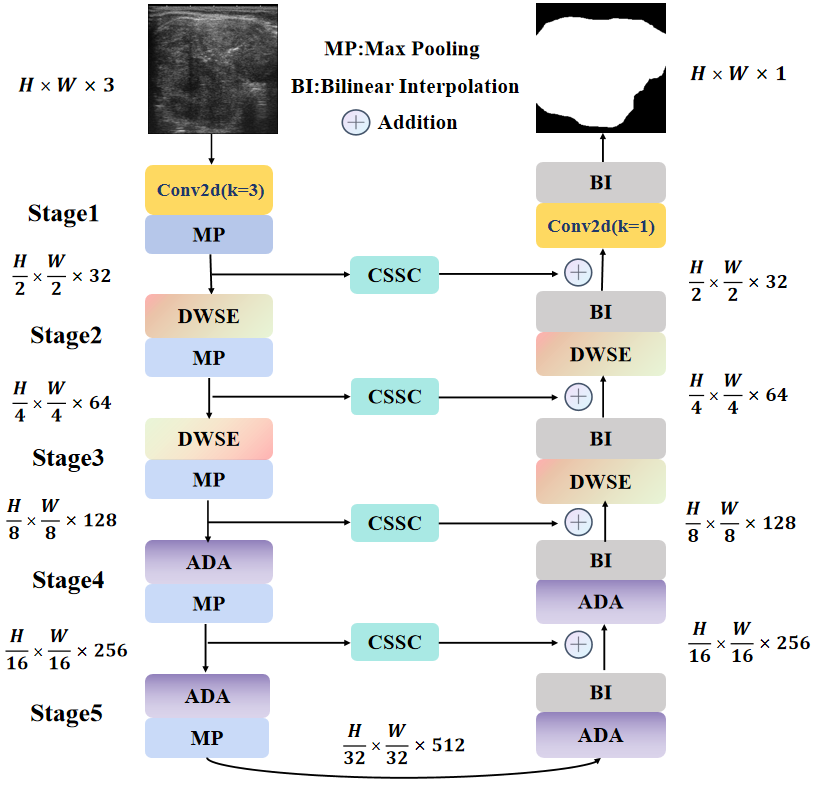

# [CBM2024]DAC-Net
🔥🔥This repo is the official implementation of
['DAC-Net : An Light-weight U-shaped Network Based Efficient Convolution And Dual-Attention for Thyroid Nodule Segmentation'](https://www.sciencedirect.com/science/article/pii/S0010482524010576), accepted at Computers in Biology and Medicine2024🔥🔥




## Main Environments

- python 3.9
- pytorch 2.1.0
- torchvision 0.16.0


## Requirements

Install from the `requirements.txt` using:

```
pip install -r requirements.txt
```


## Prepare the dataset.

- The DDTI datasets, can be found here ([Google Drive](https://drive.google.com/file/d/1FfrVeiL7F5375BOAATz2s1J_jD-gTTbW/view?usp=drive_link))
- The TN3K datasets, can be found here ([Google Drive](https://drive.google.com/file/d/1gadDP0V0F1LGdPXsTwFbNowPbFOoCHyN/view?usp=drive_link))

#### Then prepare the datasets in the following format for easy use of the code:

```
├── datasets
    ├── DDTI
    │   ├── Test_Folder
    │   │   ├── img
    │   │   └── labelcol
    │   ├── Train_Folder
    │   │   ├── img
    │   │   └── labelcol
    │   └── Val_Folder
    │       ├── img
    │       └── labelcol
    └── TN3k
        ├── Test_Folder
        │   ├── img
        │   └── labelcol
        ├── Train_Folder
        │   ├── img
        │   └── labelcol
        └── Val_Folder
            ├── img
            └── labelcol
```


## Reference
- [UNet](https://github.com/ZJUGiveLab/UNet-Version)
- [UNet++](https://github.com/ZJUGiveLab/UNet-Version)
- [UNet3+](https://github.com/ZJUGiveLab/UNet-Version)
- [MultiResUNet](https://github.com/makifozkanoglu/MultiResUNet-PyTorch)
- [TransUNet](https://github.com/Beckschen/TransUNet)
- [UCTransNet](https://github.com/McGregorWwww/UCTransNet)
- [ACC_UNet](https://github.com/qubvel/segmentation_models.pytorch)


## Citation

If you find this work useful in your research or use this dataset in your work, please consider citing the following papers:
```
@article{2024DAC,
  title={DAC-Net: A light-weight U-shaped network based efficient convolution and attention for thyroid nodule segmentation},
  author={ Yang, Yingwei  and  Huang, Haiguang  and  Shao, Yingsheng  and  Chen, Beilei },
  journal={Computers in Biology and Medicine},
  volume={180},
  year={2024},
}
```

